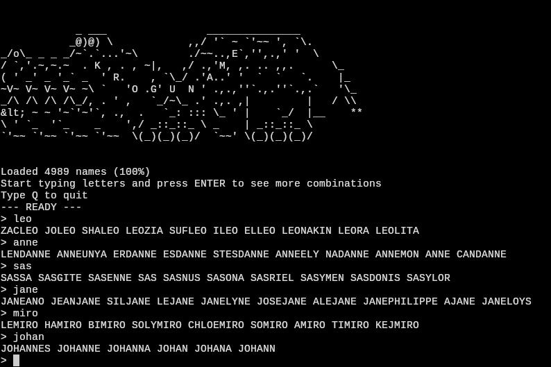

KroGuName
---

This is a small project made at [Code Dojo Bern](https://codedojo.ch) on June 4, 2025.
You will be asked to enter some letters. If they match any of the prefixes or suffixes, then random combinations of new names will be generated. If no match is found, the program will try to just find matching names in the database.

Maybe it can help you to find a new name for a role-playing character or online profile?

Inspired by Krogufant by Sara Ball, a book for small children where you can shuffle the names and pictures of animals together into an imaginary animal:

_Image source: [beltz.de](https://www.beltz.de/kinderbuch_jugendbuch/produkte/details/6323-krogufant.html)_

There is a fun interactive version of this: [watson-Krogufant](https://www.watson.ch/spass/schweiz/137498035-krogufant-online-ihr-habt-gezeichnet-und-wir-haben-das-tool#images).

# How to use

To run the script, install [uv - Astral](https://docs.astral.sh/uv/) and then run:

`uv run kroguname.py`

# Data source

An open dataset of the first names of children born over the past 30 years in a region of Switzerland was used here.

"Vornamen, ab 1987" (Open use) from the Statistics and Data Service Fribourg is included in Parquet format. It can be freely downloaded from [opendata.swiss](https://opendata.swiss/en/dataset/vornamen-ab-1987). Some minor adjustment was done to reduce the size of the file.

For another app with this kind of data, see: https://vornamen.opendata.ch/

[Claude 3.7 Sonnet](https://assets.anthropic.com/m/785e231869ea8b3b/original/claude-3-7-sonnet-system-card.pdf) on the free version of [Zed](https://zed.dev/) were used to help develop the `syllalib.py` library, which splits the names into complementary arrays by syllables.

# License

CC0 1.0 Universal (Public Domain)
